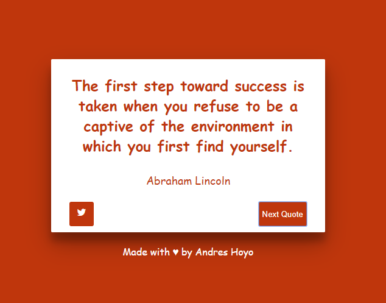
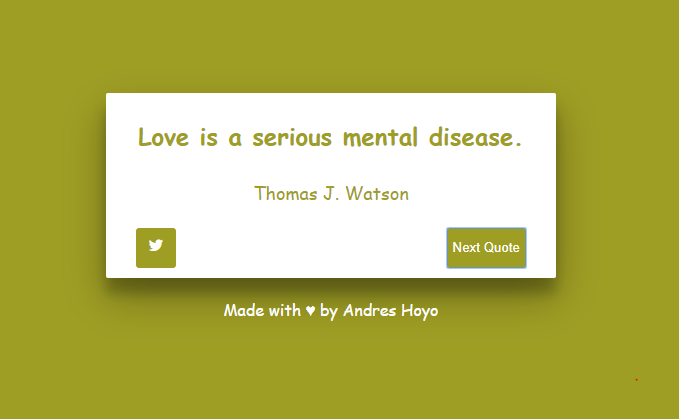

# Random quote machine
    this project is part of freecodecamp        
    https://learn.freecodecamp.org/front-end-libraries/front-end-libraries-projects/build-a-random-quote-machine/

## Available Scripts
    In order to run you need have installed npm.
    In the project directory, you can run:

### `npm start`

Open [http://localhost:3000](http://localhost:3000) to view it in the browser.

## Preview

